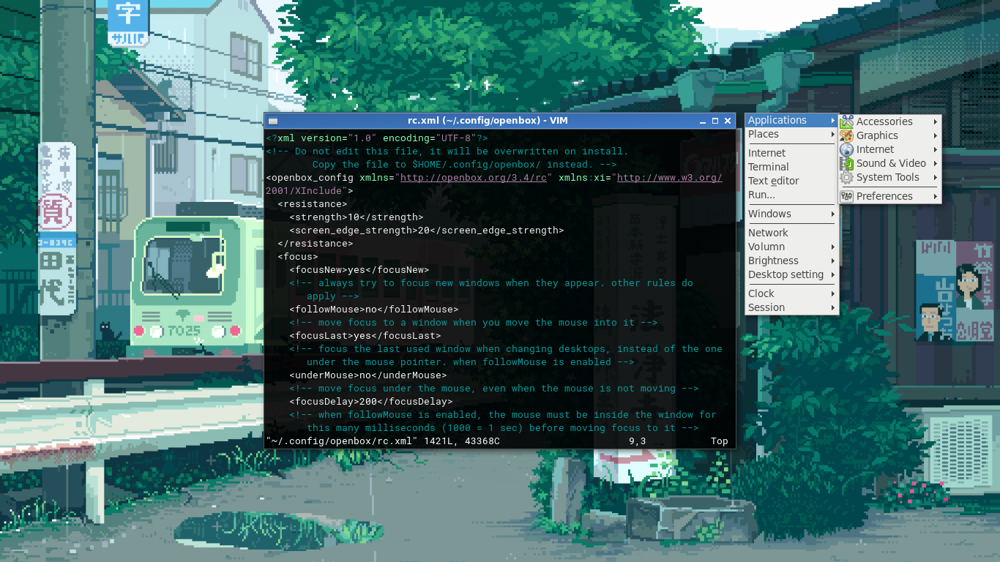

# My dotfiles

A backup of my simple dotfiles.

**This dotfiles is deprecated, I'm planning to make new one.**

## About

This dotfiles include:

- My favorite tools config such as: urxvt, tmux, vim, rofi, bash...
- Window manager, desktop environment, taskbar, notification and themes: openbox, xfce4...
- Coding fonts support Vietnamese.
- Some script such as: lockscreen, screenshot, color picker...
- Default wallpaper.

## Ubuntu 18.04 packages

```sh
sudo apt install \
openbox lxappearance lxappearance-obconf tint2 rofi i3lock compton lxmenu-data qt5-style-plugins pcmanfm \
tmux xclip xsel xdotool xbacklight redshift upower policykit-1-gnome slop htop ibus-unikey scrot zenity mtools \
git curl wget wuzz w3m lynx network-manager nmap sshfs transmission-cli \
vim vim-gtk3 imagemagick ffmpeg gifsicle inkscape gimp \
vlc mplayer pavucontrol feh viewnior cmus simplescreenrecorder \
jmtpfs udisks2 ranger mc tree zip unzip rar unrar p7zip-full trash-cli \
gpick build-essential python-pip python3-pip \
atool bsdtar caca-utils highlight sed mupdf-tools poppler-utils jq odt2txt mediainfo \
zangband nudoku fceux volumeicon-alsa \
```

## Manjaro packages

```sh
sudo pacman -S xorg xorg-server xorg-xinit openbox i3 lxappearance lxappearance-obconf tint2 dmenu rofi i3lock compton pcmanfm dunst gnome-icon-theme gtk-engines \
bash-completion tmux xclip xsel xdotool xorg-xinput xorg-xbacklight redshift upower slop htop scrot zenity mtools rxvt-unicode community/polkit-gnome pulseaudio pulseaudio-alsa alsa-utils dunst \
git curl wget w3m lynx nmap sshfs net-tools transmission-cli firefox \
gvim neovim imagemagick ffmpeg gifsicle inkscape gimp \
vlc mplayer pavucontrol feh cmus simplescreenrecorder viewnior \
udisks2 ranger mc tree zip unzip unrar p7zip trash-cli \
cantarell-fonts noto-fonts noto-fonts-cjk noto-fonts-emoji terminus-font ttf-bitstream-vera \
gpick atool highlight sed mupdf-tools poppler mediainfo yay base-devel volumeicon figlet python-pip python2-pip \
# qemu dnsmasq vde2 bridge-utils openbsd-netcat qemu-arch-extra extra/gtkglext xf86-video-vmware xf86-input-vmmouse
# virt-manager virt-viewer
```

## Screenshots



